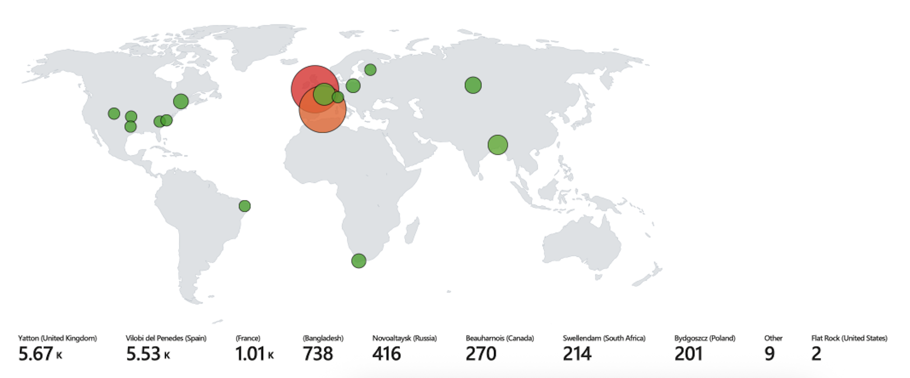

# Azure Honeypot Project

##  Purpose & Research Goal
This project demonstrates how to deploy and operate a simple honeypot in Microsoft Azure to collect, enrich and visualize real-world attack attempts. The honeypot consists of a single Windows virtual machine deliberately exposed to the internet (RDP open) to attract brute-force login attempts. Collected telemetry is shipped to a Log Analytics Workspace and ingested into Microsoft Sentinel where it is enriched with GeoIP data and visualized as an attack map.

### Scope and assumptions
- Lab-only setup: all resources are owned by the tester and run in an isolated subscription.  
- The VM is used for monitoring only (no production data).  
- GeoIP enrichment uses a static watchlist (geoip-summarized.csv); results depend on that dataset’s accuracy.  
- This is an IDS/logging exercise (not an active blocking IPS).

---

##  Step-by-Step Methodology (what was done and why)

### 1. Subscription and Resource Setup
- Created an Azure subscription and a dedicated resource group (`JM_SOC_Lab`) to isolate the experiment.  
- Why: Using a dedicated resource group makes it easier to keep track of all resources related to the honeypot. It also allows you to delete everything at once when the project is finished, which helps avoid unnecessary costs and prevents accidental exposure of production resources

### 2. Virtual Machine Deployment (the attack surface)
- Deployed a Windows VM named **CORP-Net-Middle** with a public IP (48.220.32.93).  
- Why: Windows machines with open RDP are one of the most commonly targeted systems on the internet. By creating such a machine, it becomes a realistic “bait” for automated scanners and brute-force attacks, making it ideal for collecting real-world attack data.

### 3. Network Security Group (NSG) configuration
- Configured the NSG to allow inbound RDP (3389/TCP) from any source.  
- Why: Allowing RDP from anywhere exposes the VM to the wider internet, which ensures that attackers can find and attempt to log in. This is unsafe for a production environment but useful for a honeypot because it attracts activity quickly.

### 4. Validating reachability
- Performed connectivity tests (ping, RDP connection attempts) to ensure the VM was reachable.  
- Why: Before analyzing attack logs, it is important to confirm that the VM is actually reachable. If connectivity is blocked, no real data would be collected. Testing ensures that any failed logins seen in the logs are genuine attempts from the internet.

### 5. Generating and Capturing Events
- Conducted controlled failed logins (`employee`) and confirmed Event ID 4625 appeared in Windows Security logs.  
- Why: Controlled failed logins help verify that the monitoring pipeline works correctly. By seeing Event ID 4625 appear, you confirm that authentication failures are captured. This gives confidence that real attacker activity will also be recorded

### 6. Centralized Logging via Log Analytics (LAW)
- Created a Log Analytics Workspace and installed the Azure Monitor Agent on the VM.  
- Why: LAW collects and stores logs in one central place, instead of leaving them only on the VM. Centralized storage makes it possible to run queries across multiple events, keep historical records, and prepare the data for use in Sentinel.

### 7. Microsoft Sentinel integration
- Enabled Sentinel and connected it to LAW. Configured the **Windows Security Events** connector via AMA.  
- Why: Sentinel acts as the SIEM (Security Information and Event Management) system. It allows you to query logs using KQL, set up alerts, and build dashboards. This turns raw log data into something analysts can easily understand and use to detect patterns or suspicious behavior.

### 8. GeoIP enrichment (watchlist)
- Imported `geoip-summarized.csv` as a Sentinel Watchlist and used `ipv4_lookup()` in KQL to convert IP addresses to city/country coordinates.  
- Why: Raw IP addresses are hard to interpret. By enriching them with geographic data, you can see which countries and regions are responsible for login attempts. This adds context to the analysis and makes it possible to present results visually on a map.

### 9. Attack Map workbook
- Built a workbook (map.json) in Sentinel to visualize failed login attempts by location and time.  
- Why: Seeing attack data on a map provides an immediate and intuitive understanding of the scale and origin of the attacks. It helps to identify clusters, spot repeated attackers from certain regions, and makes the findings more engaging and useful for reporting or presentations.

---
## Results from the honeypot
The map shows the geolocation of failed login attempts (Event ID 4625) against our honeypot VM.
During the observation period, I recorded 13.000+ attempts from multiple ip-adresses, all over the world, in just 24h.
The largest clusters on the map come from UK, Spain, and France, suggesting that most of the traffic came from automated RDP brute-force scanners. The reason that the most of the tries was from Europe may be because of the VM's location in France. Several points represent repeated attempts from the same IP ranges, and the time-series data (see figure) shows clear peaks outside normal working hours — typical for bot-driven traffic.

It is important to note that GeoIP data only provides an estimate of geographic origin and may be inaccurate for some IP ranges. As seen in the `kql_results_location.png`, there is sign that IP's from India and China was used aswell. The map should therefore be used as a visual aid rather than absolute proof.

---

##  Expected Analyses & Outcomes
By analyzing the collected data we can:
- Measure arrival time of first attacks after exposure.
- Identify top source IP addresses and their geolocation.
- Visualize attack volumes over time (time series) and geographically (attack map).
- Demonstrate how Azure tools (LAW + Sentinel + Watchlists) can form a simple, effective SOC pipeline.

---
### References

- ChatGPT (OpenAI). (2025). Conversation and documentation assistance for the Azure Honeypot project  
- YouTube — Josh Makador, <https://youtu.be/g5JL2RIbThM?si=Fz2lI49c_wk6ghTy
- GeoIP dataset: Josh Madakor. `geoip-summarized.csv`,  <https://raw.githubusercontent.com/joshmadakor1/lognpacific-public/refs/heads/main/misc/geoip-summarized.csv  
- Lab Checklist, <https://docs.google.com/document/d/143seB9PwT9GSsStc14vPQWgnCHQeVMVEC6XBRz67p_Q/edit?tab=t.0
